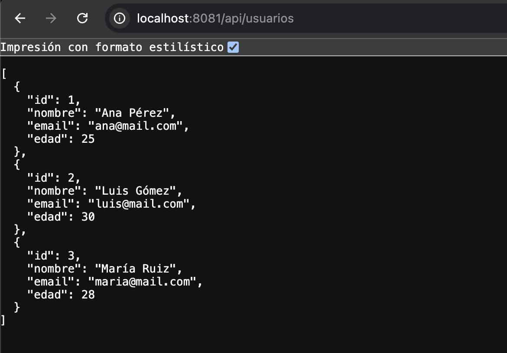

# API de usuarios

API REST creada con Java 17, Spring Boot 3, Spring Data JPA y H2 en memoria. Implementa una arquitectura por capas: `controller -> service -> repository`.

## Requisitos

- Java 17 o superior
- Maven 3.6 o superior

## Ejecutar

```bash
mvn spring-boot:run
```

La aplicación queda disponible en `http://localhost:8080`.

## Endpoints

| Método | Ruta | Resultado |
| --- | --- | --- |
| GET | `/api/usuarios` | Lista todos los usuarios. |
| GET | `/api/usuarios/{id}` | Devuelve un usuario por identificador; responde `404` si no existe. |

Ejemplo:

```bash
curl http://localhost:8080/api/usuarios
```

Respuesta esperada:

```json
[
  {"id": 1, "nombre": "Ana Pérez", "email": "ana@mail.com", "edad": 25},
  {"id": 2, "nombre": "Luis Gómez", "email": "luis@mail.com", "edad": 30},
  {"id": 3, "nombre": "María Ruiz", "email": "maria@mail.com", "edad": 28}
]
```

## Base de datos

La configuración usa H2 en memoria (`usuariosdb`). Los 3 registros iniciales se cargan desde `src/main/resources/data.sql`. La consola de H2 está dispoonible en `http://localhost:8080/h2-console` mientras la aplicación está ejecutándose, usa la URL JDBC `jdbc:h2:mem:usuariosdb`, usuario `sa` y contraseña vacía.

## Pruebas

```bash
mvn test
```

Las pruebas de integración comprueban la carga inicail y ambos endpoints.

## Captura de funcionamiento

La siguiente captura muestra la respuesta de `GET /api/usuarios` con los tres usuarios cargados desde `data.sql`.


